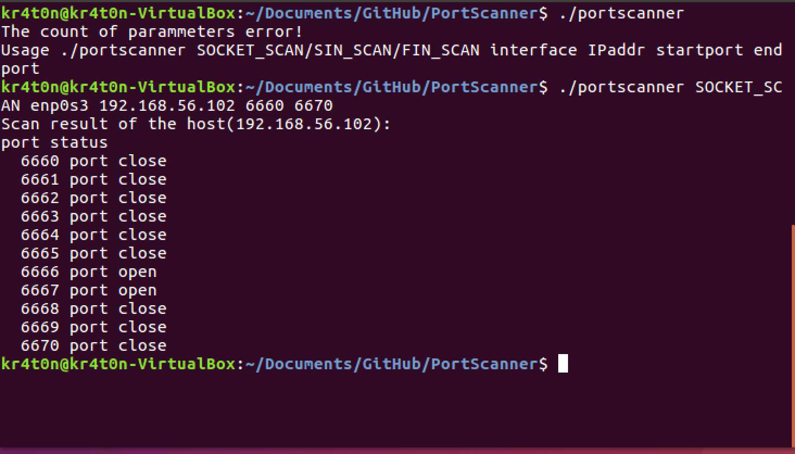

# PortScanner V1.0
[](https://travis-ci.org/Kr4t0n/PortScanner)

This a simple prototype of portscanner using three kinds of scanning modes, SOCKET_SCAN, SYN_SCAN and FIN_SCAN.

# Dependency
This prototype is mainly implemented under Linux.  
Following libraries should include:

* Libnet
* Libpcap

# How to build
```bash
g++ -o portscanner portscanner.cpp -lpcap -lnet -lpthread
```
or simply

```bash
make && make clean
```

# Usage
```bash
./portscanner SOCKET_SCAN/SIN_SCAN/FIN__SCAN interface IPaddr startport endport
```

# Example



